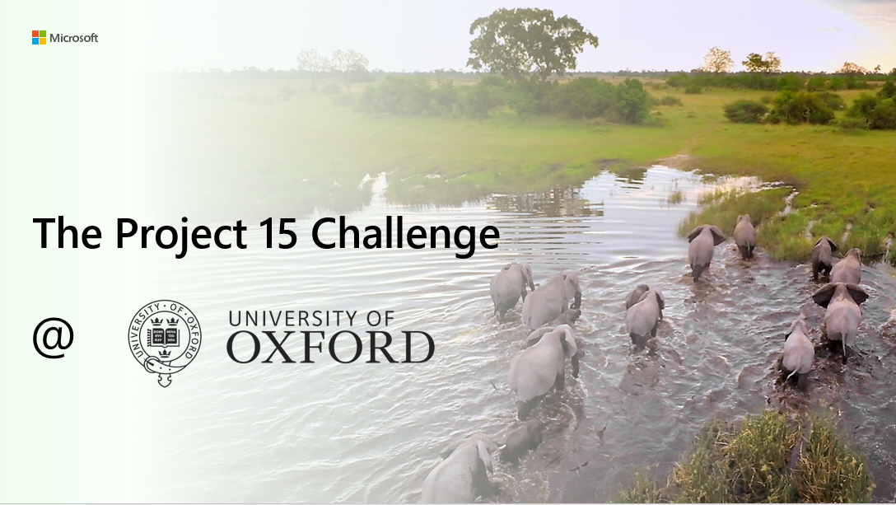

# Project 15 Challenge from Microsoft

## What is the Project 15 Challenge?

We have big problems to solve in this world and we are running out of time.  It can be overwhelming to think about.  But if we as a technical community and scientific community come together, we can do this. We must.
To put it simply, the P15 Challenge is an attempt to get to scale on unlocking and unblocking unsolved use cases in conservation and sustainability.  By putting the use cases “out there” for the open-source developer community and academic community to learn what they can help solve.

Whether you are here looking for a side project idea, planning a sustainability hackathon, a professor looking for interesting semester projects or an NGO that found this place on the internet and have a problem you’d like help solving.  We hope this challenge, added to all the other great hacks and initiatives, can contribute to bring solutions.

## Framework Outline

1. **NGO contributes a topic**
An NGO will contribute a topic related to their area of work.  These can range from conservation in biodiversity to oceans to urban sustainability.

1. **Background on a topic**
The background and resource links to learn more about the area of science will be contributed. This will not be an exhaustive list but points the developer or team of developers in the right direction to learn about what they are embarking to help unlock.

1. **Use cases to solve**
There are many use cases that scientists and organizations do not have the resources to focus on as much as they would like.  It could be a case of something the technology to solve it has just been discovered.  It could be a problem that has never been solved yet but with help it could be. (See case study below with Oxford.) We all have specialties and limited bandwidth to learn everything out there. By brining these use cases to the surface for any developer to have a try at, you may just unlock something that can have a real impact on an area of study.

## The Current Project 15 Challenges

## Resources and Data Sets 
[Microsoft AI for Earth](https://www.microsoft.com/ai/ai-for-earth-tech-resources)

[Microsoft Planetary Computer Data Catalog](https://planetarycomputer.microsoft.com/catalog)

[Elephant Listening Project](https://elephantlisteningproject.org/)

## Case Study:  The First Project 15 Challenge @ University of Oxford

Professor [Ajit Jaokar](https://www.linkedin.com/in/ajitjaokar/) at the [University of Oxford](https://www.ox.ac.uk/) partnered with [Sarah Maston](https://www.linkedin.com/in/smwmaston/) and [Lee Stott](https://www.linkedin.com/in/leestott/) at Microsoft to design the first Project 15 Challenge Pilot with Peter Wrege, Director of the [Elephant Listening Project](https://elephantlisteningproject.org/) at Cornell.  Prof. Jaokar challenged his class of approx AI/ML students to look at the challenges of listening to elephants to see if they could help Dr. Wedge.

**There were no expectations this would be successful.** Unique for a course problem to solve; Even a failure was a successful try.

The students broke into 4 different groups.  All were successful at creating solutions.  One group, however, has changed the game for those studying infrasound.  

Learn more about this exciting result of our pilot P15 Challenge with Oxford and Elephant Listening Project:

In short, there wasn’t a way to “count elephants” in spectrographs that was automated.  There were two categories “one elephant” and “two or more.”

To see their project:

[Microsoft Project15 & University of Oxford Capstone Project with Elephant Listening Project Team 1](https://techcommunity.microsoft.com/t5/educator-developer-blog/microsoft-project15-amp-university-of-oxford-capstone-project/ba-p/2261923)

[Microsoft Project15 & University of Oxford Capstone Project with Elephant Listening Project Team 2](https://techcommunity.microsoft.com/t5/educator-developer-blog/microsoft-project15-amp-university-of-oxford-capstone-project/ba-p/2262001)

[Microsoft Project15 & University of Oxford Capstone Project with Elephant Listening Project Team 2](https://techcommunity.microsoft.com/t5/educator-developer-blog/microsoft-project15-amp-university-of-oxford-capstone-project/ba-p/2262001)

[Microsoft Project15 & University of Oxford Capstone Project with Elephant Listening Project Team 3](https://techcommunity.microsoft.com/t5/educator-developer-blog/microsoft-project15-amp-university-of-oxford-capstone-project/ba-p/2262001)

[Microsoft Project15 & University of Oxford Capstone Project with Elephant Listening Project Team 4](https://techcommunity.microsoft.com/t5/educator-developer-blog/microsoft-project15-amp-university-of-oxford-capstone-project/ba-p/2262312)

## How do I get involved?

If you are a developer, a hackathon organizer or a student, everything is here to give inspiration on ideas to work on.  
If you are an NGO who is GitHub saavy, you can contribute your P15 Challenge materials to this repo following the framework.  (Just have a look at the one for Elephant Listening Project as an example.)

Any questions you can post an Issue here on GitHub, or email project15@Microsoft.com
